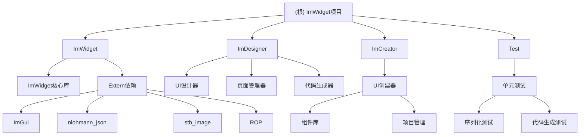

# ImWidget - 用户界面控件编辑器项目架构

## 项目愿景

ImWidget是一个基于ImGui的高级C++用户界面控件编辑器框架，旨在提供快速、灵活的UI开发工具。支持可视化编辑、代码生成、序列化等功能，适用于游戏开发、应用程序UI制作等多种场景。

## 架构总览

ImWidget采用模块化设计，主要包含以下几个核心模块：

### 模块结构图



### 模块索引

| 模块路径 | 语言 | 入口文件 | 测试目录 | 配置文件 | 职责描述 |
|---------|------|----------|----------|----------|----------|
| **ImWidget** | C++ | ImWidget/ImWidgetConfig.h | 无 | CMakeLists.txt | 核心UI框架库，提供基础控件、事件系统、序列化等核心功能 |
| **ImCreator** | C++ | ImCreator/Include/ImBasicWidgetDeclaration.h | 无 | CMakeLists.txt | UI创建器，提供组件库、文件管理、项目管理等功能 |
| **ImDesigner** | C++ | ImDesigner/Source/ImDesigner_main.cpp | 无 | CMakeLists.txt | UI设计器，提供可视化编辑、页面管理、代码生成等高级功能 |
| **Test** | C++ | Test/Source/ImUserWidgetClassTest.cpp | 无 | CMakeLists.txt | 单元测试，验证序列化、代码生成、用户控件类等功能 |

## 运行与开发

### 构建要求
- CMake 3.15+
- C++17标准
- 支持平台：Windows 64-bit、Linux ARM
- 依赖库：ImGui、nlohmann_json、stb_image、ROP

### 构建命令
```bash
# Windows 64-bit
cmake -B build -S . -DBUILD_PLATFORM=win64
cmake --build build --config Release

# Linux ARM
cmake -B build -S . -DBUILD_PLATFORM=linux-arm
cmake --build build
```

### 主要可执行文件
- **ImCreator_win64**: UI创建器工具
- **ImDesigner_win64**: UI设计器工具
- **ImWidgetTest**: 单元测试程序

## 测试策略

项目采用集中式测试策略，所有测试代码位于Test模块：
1. **序列化测试**：验证ImUserWidgetClass的序列化和反序列化功能
2. **代码生成测试**：验证从JSON生成C++代码的功能
3. **控件测试**：验证基础控件的创建和属性设置

## 编码规范

- 遵循ImGui的命名约定：以`Im`前缀开头
- 使用C++17标准特性
- 采用RAII和现代C++设计模式
- 支持Unicode字符集（Windows）
- 使用ROP属性系统进行动态属性访问

## AI使用指引

### 关键系统理解
1. **ROP属性系统**：用于运行时属性访问，支持动态类型
2. **事件发布机制**：基于字符串的事件系统，支持跨模块通信
3. **序列化系统**：基于nlohmann_json的JSON序列化
4. **代码生成器**：从JSON描述生成C++类代码

### 重要类和接口
- `ImWidget`: 所有控件的基类
- `ImPanelWidget`: 容器控件基类
- `ImUserWidget`: 用户自定义控件基类
- `ImBasicWidgetDeclaration`: 基础控件声明
- `ImUserWidgetClass`: 用户控件类定义

## 变更记录 (Changelog)

### 2024-02-05 v1.2.0
- 首次AI上下文初始化
- 识别项目核心模块：ImWidget、ImCreator、ImDesigner、Test
- 生成模块结构图和文档框架